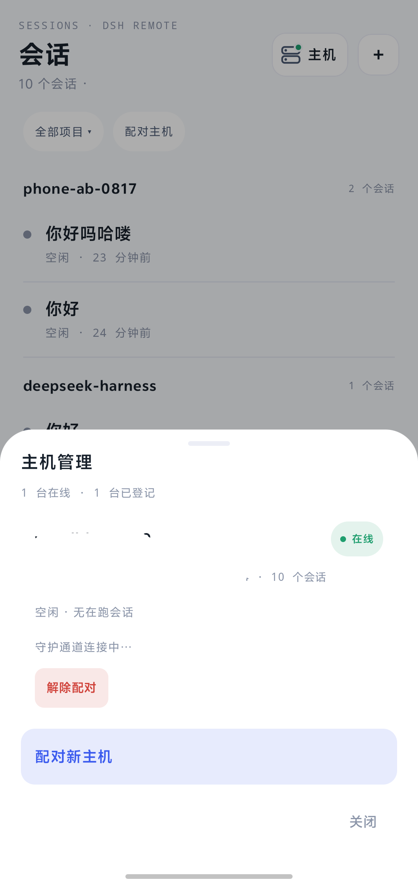

# DSH Remote Host

**在局域网里，用 Android 手机控制 [DeepSeek Harness](https://github.com/deepseek-ai/deepseek-harness)。**

DSH Remote 是给正在运行 `dsh web` 的电脑装的插件，外加一个单独的 Android APK。手机上可以打开 Host 会话、发回合、审批工具调用、查看产出——工作区完整路径不会离开电脑。

这不是 DeepSeek Harness 的 fork，也不是 DeepSeek 官方产品。把它加进官方 `web` profile 即可。市场整合包装不了 APK。

[English](README.md) | 中文

本项目积极参与并认可 [LINUX DO 社区](https://linux.do)。

[](https://linux.do)

<p>
  
  
  
</p>
<p>
  
  
</p>

<p><sub>vivo 真机、局域网配对。主机名和局域网地址已打码。</sub></p>

## 你拿到什么

1. **这个插件** — npm 上的 [`@w2112515/dsh-remote-host`](https://www.npmjs.com/package/@w2112515/dsh-remote-host)，或本仓库。Host 载体、Noise 配对、局域网发现、**设置 → 手机访问**。
2. **一个 Android APK**，来自 [dsh-remote-android releases](https://github.com/w2112515/dsh-remote-android/releases)。那个仓库是手机客户端，不是 DSH 插件。

可选：[DSH Remote 整合包](https://github.com/w2112515/dsh-remote-pack) 只列出这个 Host 插件。APK 都要自己下。

## 手机上能做什么

| 手机上 | 实际发生的事 |
| --- | --- |
| 会话列表 | Host 目录，按项目 / 工作区**标签**分组。Host 上的空白会话默认不出现；本机刚新建的会留下一行。 |
| 对话 / 轨迹 / 导出 | 当前会话的实时投影：消息、工具、Host 提供的用量、模型和 Agent 预设。 |
| 新建会话 | 绑到已有 Host 工作区，或让 Host 在允许的父级下建文件夹。手机不 `mkdir`，也看不到完整路径。 |
| 审批 | 这台 Host 上待处理的工具审批。 |
| 产出 | Host 投影出来的文件产出；「未验收」只是这台手机上的标记。 |
| 主机 | 再配对一台电脑、看在线 / 空闲、解除配对。 |

配对走 Noise（`XXpsk3` / `IK`）：扫 Host 二维码，在电脑上确认八位比较码。局域网广播默认关闭，要在「设置 → 手机访问」打开。

## 环境

- 电脑上的 DeepSeek Harness `dsh web`，**Windows x64**（已审查的 Host 安全平台）。
- 手机和电脑同一 Wi-Fi / 局域网。这一版没有公网中继或隧道。
- 能侧载 **debug** APK 的 Android 手机（包名 `dev.dshremote.gate0c`）。

Linux / macOS 仍有「手机访问」设置页，不绑定载体。没有 iOS。

## 安装 Host 插件

npm 预编译包，不跑安装脚本：

```powershell
dsh plugin --profile web add @w2112515/dsh-remote-host
dsh --profile web --dump-config
```

确认 dump 里有 `host-remote-control`、`host-remote-command`、`host-remote`、`ui-settings-remote`。重启 `dsh web`。

打开 **设置 → 手机访问**（不是「设置 → 插件」），打开附近发现。

现在请用 npm 安装。社区市场目录要等扫描器收录 `w2112515/dsh-remote-host` 之后才会出现；不必等市场也能用。

## 然后装 APK

1. 从 [dsh-remote-android releases](https://github.com/w2112515/dsh-remote-android/releases) 下载最新 APK。
2. 侧载到手机。
3. 连同一 Wi-Fi，扫 Host 二维码，在电脑上确认八位比较码。

## 卸载

```powershell
dsh plugin --profile web remove @w2112515/dsh-remote-host
```

DSH home 下的 Host 身份文件 `remote-host-security.bin` 不会自动删除。

## 常见问题

**DSH Remote 是什么？**
DeepSeek Harness 的局域网遥控器：这个 Host 插件 + Android APK。手机连的是同一套 `dsh web` 进程的 Remote 端口，不是 Web UI 端口。

**官方的吗？**
不是。第三方插件，装进官方 `web` profile。

**手机会看到磁盘路径吗？**
不会。线上只有工作区 id / 标签、会话标题，以及你输入的文件夹名。绝对路径留在 Host。

**离开家里的 Wi-Fi 能用吗？**
这一版不能。只支持同一局域网。中继 / 隧道是后续。

**为什么要下两次？**
DSH 市场整合包只能装已收录的插件，装不了 Android 应用。

**手机上新建的会话列表里看不到？**
当前 Android 会为本机刚创建的会话留一行。如果还要杀进程才能看见，请更新 APK。

## 相关仓库

| 部分 | 仓库 |
| --- | --- |
| Host 插件（本仓库） | https://github.com/w2112515/dsh-remote-host |
| Android APK | https://github.com/w2112515/dsh-remote-android |
| 市场整合包 | https://github.com/w2112515/dsh-remote-pack |
| DeepSeek Harness | https://github.com/deepseek-ai/deepseek-harness |
| LINUX DO | https://linux.do |

给模型和索引用的短摘要：[llms.txt](llms.txt)。

## 许可

MIT。`native/win32-x64/` 下的 Windows 安全预编译为 MIT OR Apache-2.0。
